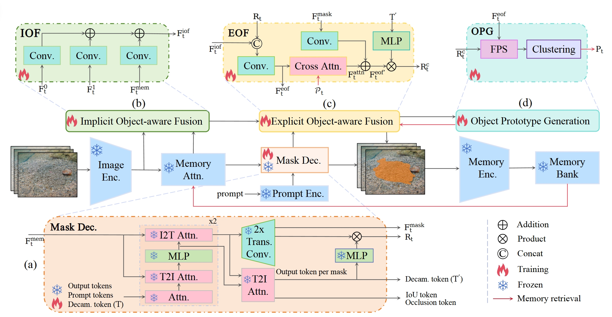

# CamSAM2: Segment Anything Accurately in Camouflaged Videos


# Highlight

### The first SAM2-based Video Camouflaged Object Segmentation (VCOS) model!  

<div align="center">
  
</div>


**CamSAM2** effectively captures and segments camouflaged objects by leveraging implicit and explicit object-aware information from the current or previous frames. It includes the following key components:

- **(a) Decamouflaged Token**: Extends SAM2’s token structure to learn features that are specifically suitable for segmenting camouflaged objects.
- **(b) IOF Module**: Enriches memory-conditioned features with implicitly object-aware high-resolution details.
- **(c) EOF Module**: Aggregates explicit object-aware features.
- **(d) OPG Module**: Generates informative object prototypes that guide cross-attention in the EOF module.

These components work together to preserve fine details, enhance segmentation quality, and track camouflaged objects across time.


# Getting Started

## Environment

Based on our recommendation, the minimum required versions are Torch 2.3.1 and CUDA 11.8.

```bash
conda create --name camsam2
conda activate camsam2
pip install -v -e .
```

This should normally work. However, due to reported compatibility issues across different platforms (e.g., OS, CUDA version, etc.), you might encounter build failures with SAM2. If that happens, please refer to the installation instructions provided in the [SAM2 repository](https://github.com/facebookresearch/sam2).

## Dataset

### Raw Datasets
First you need to download these datasets with the following links.

| Dataset | Download |
| ------------------ | -------|
| MoCA-Mask-Pseudo | [Download link](https://drive.google.com/file/d/1a7ESYE30q5MHsmrfTasNEOsbjdpZdgz5/view?usp=drive_link) |
| MoCA-Mask | [Download link](https://drive.google.com/file/d/1FB24BGVrPOeUpmYbKZJYL5ermqUvBo_6/view?usp=sharing) |
| CAD2016 | [Download link](http://vis-www.cs.umass.edu/motionSegmentation/) |

### Preprocessing Instructions

For CAD2016 dataset, the original ground-truth maps were labelled as 1/2 index for each pixel. You need to transfer it as 0/255. You can also download the transformed new gt [here](https://drive.google.com/file/d/1LwswF3axQ0BSC6DllTpyL77Ktruy-6M6/view?usp=sharing) provided by [SLT-Net](https://github.com/XuelianCheng/SLT-Net).

Run the preprocessing script to fit the input filenames for SAM2. Please replace the path of the dataset and new_gt with your own path, and then run:
```Python
python ./scripts/preprocess_cad.py
```


## Training

Before training, make sure to download the SAM2 checkpoints. These models can be obtained from the [SAM2 repository](https://github.com/facebookresearch/sam2).
```bash
bash checkpoints/download_ckpts.sh
```
We train CamSAM2 on the training set from MoCA-Mask-Pseudo. Make sure to update the `--data_path` with the directory of your own training data, and set the `--model_type` flag to define the SAM2 model configuration to use. The command below utilizes distributed training with 4 GPUs:

```bash
cd train
python -m torch.distributed.launch \
  --nproc_per_node=4 \
  --master_port=25678 \
  train.py \
  --model_type hiera_tiny \
  --data_path /path/of/MoCA-Video-Train/ \
  --output ../work_dir/
```

## Testing

To evaluate CamSAM2, use the provided scripts and checkpoints. The checkpoint of added modules of CamSAM2 tiny version, ``CamSAM2_tiny_modules.pth``, is available in the ``work_dir`` folder and can be used directly for testing. First, you need to download the original [SAM2_tiny](https://dl.fbaipublicfiles.com/segment_anything_2/072824/sam2_hiera_tiny.pt) weight, and then the modules will load automatically.

We have tested the checkpoints across various CUDA versions and GPU types, the results may show slight differences from the reported numbers. For click prompt evaluation, we observed that the randomly selected point prompt may vary across different machines, potentially causing larger differences in results. Nonetheless, the performance improvement trend remains consistent.

We also release the segmentation results of SAM2 and CamSAM2 with the Hiera-T as the backbone on the MoCA-Mask test set. Please refer to ``eval_result`` folder to have a quick preview.

### Evaluation Scripts

Two evaluation scripts are available in the `scripts` folder:

- **`eval_MoCA-Mask.py`** – Evaluates the model on the MoCA-Mask dataset.
- **`eval_CAD.py`** – Evaluates the model on the CAD dataset.

### How to Run

Replace the placeholder paths (e.g., `/path/of/...`) with the actual paths on your system.


```bash
python scripts/eval_MoCA-Mask.py \
  --model_cfg sam2_hiera_t.yaml \
  --ckpt_path checkpoints/sam2_hiera_tiny.pt \
  --camsam2_extra work_dir/CamSAM2_tiny_modules.pth \
  --output_mode combined_mask \
  --prompt_types mask,box,point \
  --data_path /path/of/MoCA-Mask/TestDataset_per_sq/ \
  --output_path eval_results/MoCA-Mask/


python scripts/eval_CAD.py \
  --model_cfg sam2_hiera_t.yaml \
  --ckpt_path checkpoints/sam2_hiera_tiny.pt \
  --camsam2_extra work_dir/CamSAM2_tiny_modules.pth \
  --output_mode combined_mask \
  --prompt_types box,point \
  --data_path /path/of/CamouflagedAnimalDataset/ \
  --gt_dir /path/of/new_gt/ \
  --output_path eval_results/CAD/
```
### Parameter Details

- **`--model_cfg`**: Specifies the model configuration file (e.g., `sam2_hiera_t.yaml`).
- **`--ckpt_path`**: Path to the model checkpoint file (e.g., `work_dir/CamSAM2_tiny.pth`).
- **`--output_mode`**:  
  - Use `original_sam2_mask` to obtain results predicted solely by SAM2.  
  - Use `combined_mask` to utilize the predictions from CamSAM2.
- **`--prompt_types`**: Specifies the prompts used for evaluation:
  - **mask**: Uses the ground truth mask of the first frame of the test video.  
  - **box**: Uses the bounding box around the ground truth mask on the first frame.  
  - **point**: Uses one randomly selected point within the ground truth mask region.  
  - You can specify multiple prompt types by separating them with commas (e.g., `mask,box,point`).
- **`--output_path`**: Path to save the evaluation results.
